<p align="center">
  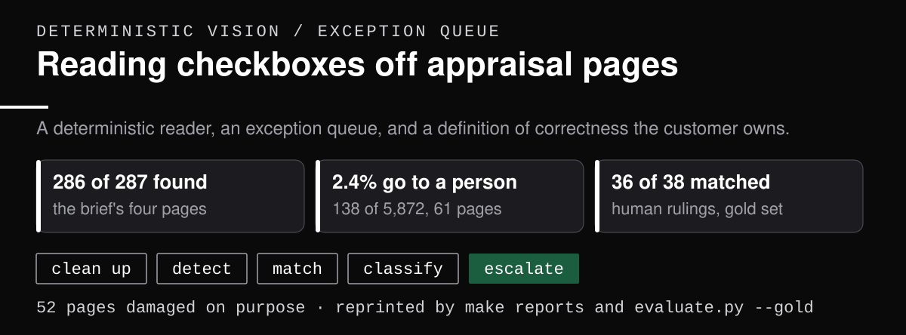
</p>

*Fail open, fail loud: read what is certain, queue what is not, and let the customer own the definition of a mark.*

# Reading checkboxes off appraisal pages

<p align="center">
  
  
  
  
  
  
</p>

An appraiser's answers live in the boxes. Is the property a PUD, are the utilities public, is the market declining. Each answer is a small square that is either marked or not, and decisions downstream depend on reading it right.

This is a service that takes a page image and returns every checkbox on it, with its position and whether it is marked. It reads what it can read with certainty, and it flags what it cannot. On the four sample pages it found 286 of 287 boxes and read 285 of those correctly. The two it was unsure about, it said so rather than guessing.

Under the hood: Python 3.13, OpenCV, a from-scratch CNN exported to ONNX and quantized to int8, FastAPI, Docker, and a pytest gate suite wired into GitHub Actions CI.

<p align="center"><code>load -> detect -> match -> classify -> escalate</code></p>

<p align="center">
  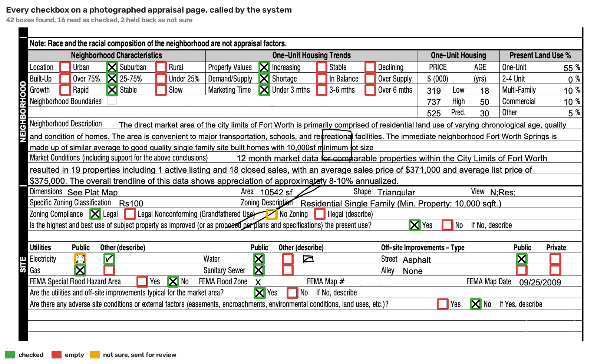
</p>

Reading boxes off the picture matters in two situations. Some documents arrive with no accompanying data file at all: older scans, faxes, third-party reviews, forms outside the standard set. And where a data file does exist, reading the picture independently is how you check the two agree. That is a quality check in its own right, not a workaround. More on that [below](#why-read-boxes-off-a-picture-when-the-data-file-already-has-them).

**Fifteen-minute path:** run the three commands below, look at [Results](#results), then read [the writeup](docs/approach.md). Everything else is depth for the review session.

## Run it

```bash
uv sync --extra dev
make serve                                                            # starts on :8000
curl -s -F file=@data/samples/sample_1.jpg localhost:8000/detect
```

You get back exactly what the brief asked for, one entry per checkbox:

```json
{"boxes": [{"bbox": [329, 506, 387, 554], "is_checked": true}, ...]}
```

Three more things run from the same place. `make docker-build && make docker-run` serves the identical thing from a container. `make test` runs every safety check. `make eval` reprints the numbers in this README from scratch.

Nothing here asks you to take a number on trust. The fastest check is to look at what it saw:

```bash
curl -s -F file=@data/samples/sample_1.jpg localhost:8000/detect/overlay > seen.png
```

That gives you the page back with every box drawn on it, green for checked, red for empty, amber for the two it refused to guess. Disagreeing with a picture takes seconds. [Where else to put your own eyes on it](#where-do-you-put-your-own-eyes-on-it) has the rest.

## What makes this hard

<p align="center">
  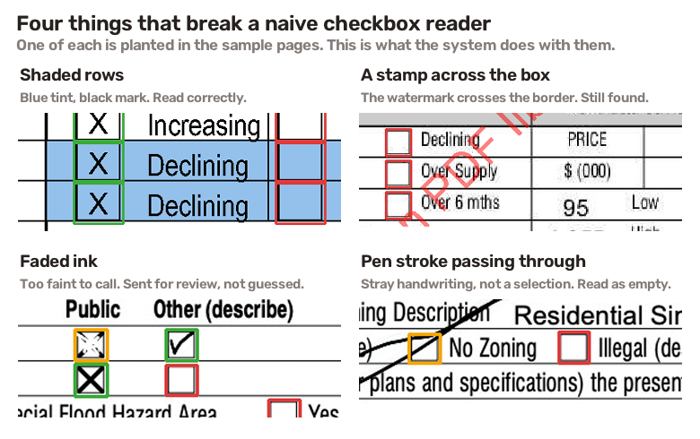
</p>

Four pages came with the brief, and each one hides a different problem. A box sitting in a shaded row. A watermark stamped straight through the border. Ink so faded a person has to squint. Handwriting that runs across an empty box and looks like a mark. Any of these will fool a simple reader, and the last two are cases where two careful people might disagree with each other.

That last point is the one that shaped the whole design. Some boxes have a right answer. Some boxes are genuinely unclear, and a system that guesses on those is worse than one that says so.

## How it works

<p align="center">
  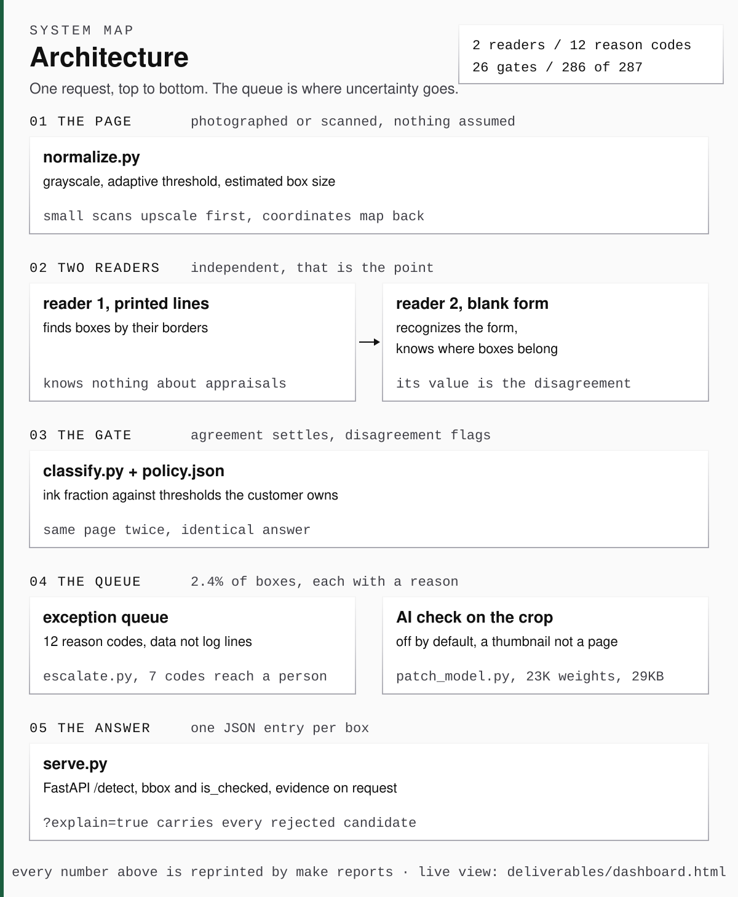
</p>

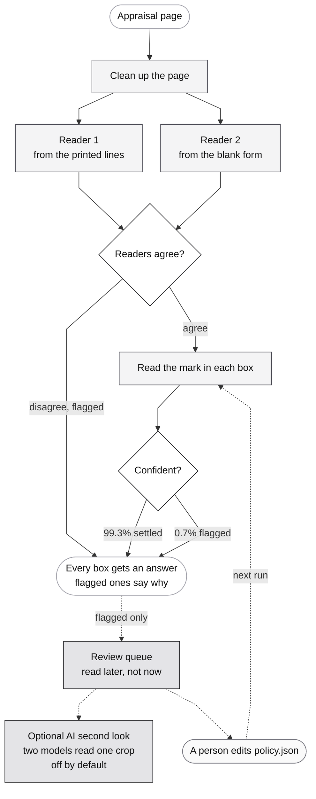

*Nothing waits on a person. Every box comes back in the same response, and a flagged one comes back with the reason it was flagged; the dotted lane is review that happens afterwards.*

Two readers look at the same page independently. The first knows nothing about appraisals; it finds boxes by their printed borders. The second knows these are standard federal forms, recognizes which one it is looking at, and knows where the boxes belong. Where both agree, the answer is settled. Where they disagree, the box is flagged rather than dropped.

<p align="center">
  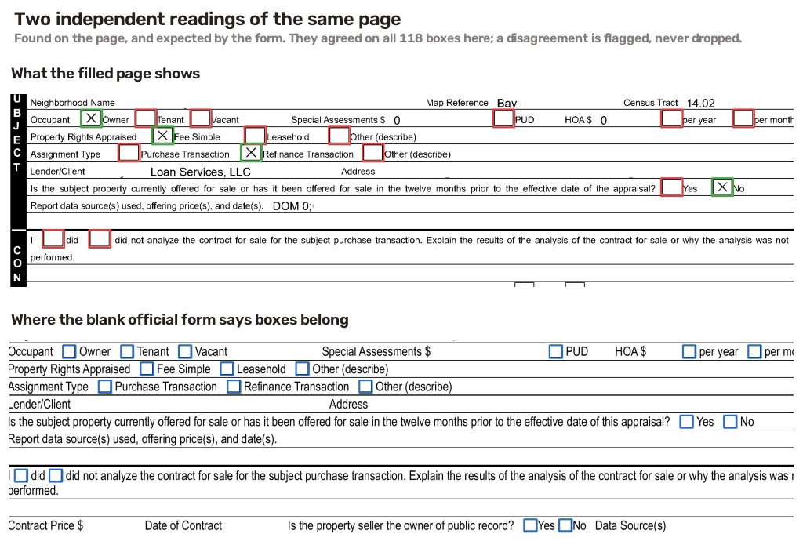
</p>

That second reader earns its place, and the way it earned it is worth telling, because it is not the way I expected. On one page the readers disagreed about a row that the official form says holds three boxes. The first reader found four there. That count was the tell. What the second reader could not do was say which of the four was the impostor: it matched its three expected positions to the first three boxes in the row, was left with the fourth, and flagged that one, which happened to be a real checkbox. The disagreement was right and the accusation was wrong. Following it anyway found the actual culprit, a box the first reader had drawn around a printed word. That reader now checks a candidate against the size of the other boxes on its page and looks for text inside it. The lesson I would keep is that the second reader's value was the disagreement, not its diagnosis.

## Four dimensions

<p align="center">
  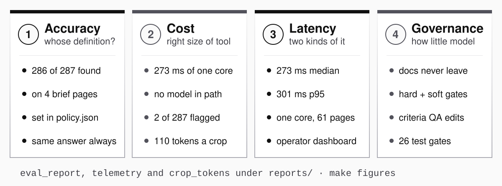
</p>

Four things decide whether something like this is worth running. The first one is the one everybody assumes is settled, and it is not.

### 1. Accuracy, measured against a definition somebody else owns

Ask what the accuracy of a checkbox reader is and the honest first answer is a question back: accurate against whose definition of a mark?

A circle drawn inside the box instead of an X. A box filled in and then struck out. A tick that overshoots the border. Each of those has a defensible answer in both directions, and none of them is ours to decide. One lender wants the circle counted. Another wants it sent to a person. Both are right about their own files.

So the definition lives in a file the customer owns, not in our code. [`policy.json`](policy.json) holds the thresholds and the three rulings people actually argue about, in their language rather than ours, and [`POLICY.md`](POLICY.md) is the same decisions written out in prose by the person who labeled the answer key.

Changing what counts as a mark is editing that file. It is not a ticket, a release, or a conversation with us:

```bash
uv run python scripts/compare_policies.py  # same code, same pages, two definitions
```

That prints the whole argument. Two boxes on the four pages read differently under the shipped policy and under a stricter customer's, and the interesting one is the scan-faded X. The shipped policy says a fragmented mark is not a selection and calls it empty, which is wrong on that box. The stricter policy says do not overrule the ink, just flag it, and gets it right. Agreement with the answer key goes 285 of 286 to 286 of 286.

That is not a bug fixed. It is a tradeoff moved to the person who should be making it, because the same rule that rescues a faded scan will also let a struck-out box report as filled. Which of those two errors you would rather have is a business question, and the file is where you answer it.

Reliability is the other half of the same dimension, and it is cheap here because nothing in the reading path is a model. The same page gives the same answer today, next quarter, and in the audit two years from now. Run it a thousand times and the bytes do not move.

### 2. Cost, by using the right size of tool

Not the smallest possible tool. The right one. A frontier model is trained to solve an enormous range of problems, and a loan file pays for none of them. Reading a hundred-pixel square needs none of that capability, so buying it for every page is paying for other people's problems.

The reading path is ordinary image processing: about three tenths of a second per page on one core, roughly four millionths of a dollar, and no model at all. A model is only ever shown a single flagged box cropped to a thumbnail, and only after the deterministic readers have said they cannot settle it.

The arithmetic is the whole argument. A cropped checkbox is about 106 tokens of image. A whole page is about 1,990, and a full-page answer runs to thousands more, because it has to list every box and its coordinates.

| Approach | Cost per page | Notes |
|---|---|---|
| Ordinary image processing (what runs) | ~$0.000004 | 0.30 s of one CPU core |
| AI on boxes the deterministic core flags | ~$0.001 | at the measured 0.7% flag rate |
| AI on those plus every box the trained model disputes | ~$0.009 | at the measured 6.6% flag rate |
| Sending every page to a strong AI model instead | ~$0.085 | ~40x more, and less accurate on checkboxes |

At real volume that gap stops being a rounding error. It is also the wrong trade on quality, not only on price. Published work on document AI finds checkbox reading is a specific weak spot for vision models. A checkbox is a handful of pixels and those models are built to read words.

### 3. Latency, and there are two kinds

The technical kind is what the page waits for. Three tenths of a second of local CPU, p50 392 ms and p95 457 ms measured through the HTTP service, with no network call in the path at all. Nothing here waits on a vendor.

That number also improves on its own, which a model-first design does not. Every behaviour we come to understand well enough to describe becomes a rule, and a rule costs microseconds. The escalation lane is meant to shrink: what starts as a model call ends as a named reason code with a threshold behind it. Code does not get slower, and it does not get repriced.

The other kind is the one an operator waits for, and it is usually the expensive one. Somebody has to know where the system is struggling without reading pages to find out. That is what the [dashboard](#what-it-looks-like-in-operation) is for, and why the reason codes exist as data rather than as log lines.

### 4. Governance, which is mostly a question of how little model you use

Every model call is customer documents leaving the building. Deterministic code is not; it runs on a machine you control, on-premises if the contract says so, and there is no vendor to ask about retention or training. This system sends nothing anywhere by default, and when the escalation lane is switched on it sends a thumbnail of one box rather than a page of somebody's finances.

The gates come in two kinds and both are visible. Hard gates are pass or fail and block the build: the response schema, the blank forms with nothing marked on them, the regression rows, the frozen answer key never being trained on. Soft gates are bands with a verdict attached, and one of ours currently reads out of band on purpose, written down in [EVALS.md](docs/EVALS.md) rather than quietly retuned.

Because the acceptance criteria are a file, QA and product can write them alongside the customer instead of translating them into a ticket for us. And because nothing in the reading path is a model, any decision can be re-run and shown, months later, to whoever is asking why the file says what it says.

## Three ways to build this

<p align="center">
  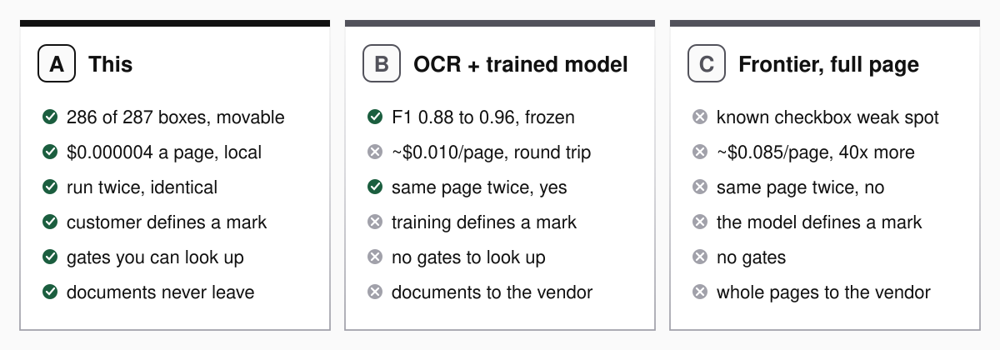
</p>

There are two obvious alternatives and they fail in opposite directions. One is the way this was built five years ago. The other is the way it would be built today by reaching for the biggest available tool.

**B, the 2021 answer.** Run an OCR engine over the page and train an object detector to find the boxes. Tesseract or a cloud document service for the text, a YOLO or Faster-RCNN model for the squares. It works, and the published numbers are respectable: F1 0.88 for a YOLOv8-large checkbox detector over 300 mixed documents, around 96% for a YOLOv5 build, around 95% for an EfficientNet-B0 reading the crops.

**C, the 2026 answer.** Send the whole page to a frontier vision model and ask for the boxes and their states in JSON. One call, no computer vision, works on any form on day one.

| | A, this | B, OCR plus a trained detector | C, whole page to a frontier model |
|---|---|---|---|
| Accuracy on these pages | 286 of 287, and movable by the customer | F1 0.88 to ~0.96 published, fixed at training time | documented weak spot on checkboxes |
| Cost per page | ~$0.000004 | ~$0.010 at $10 per 1,000 pages | ~$0.085 |
| Latency | 0.30 s, local, no network | a vendor round trip | seconds, and variable |
| Same page twice | byte-identical | yes, the weights are frozen | no |
| Who defines a mark | the customer, in a file | whoever labeled the training set | the model |
| Changing that definition | edit `policy.json` | relabel and retrain | reword the prompt and hope |
| Gates you can inspect | hard and soft, both published | none exposed | none |
| Customer documents leave | never | to the vendor | to the vendor, whole pages |

B does not lose on accuracy, which is fine. It loses because the definition of a mark is frozen inside the weights. A customer who wants circles counted cannot have that without a labeling round and a retrain, and there is nowhere to look up why any single box was read the way it was. It is a black box with no user-definable acceptance criteria and no gates, so the only way to argue with it is to build another one.

C loses differently. It pays frontier prices to read something a hundred pixels wide, and gives up determinism to do it. Published work finds checkbox reading is a specific weakness of vision models rather than a strength, which is the wrong place to spend forty times the money. And it puts whole customer pages in a third party's hands to answer a question that never needed to leave the building.

A wins here for reasons that are specific to here, and it is worth naming them so the boundary is visible. This problem has a small number of standardized federal forms, a hard requirement to explain any answer later, and customers who disagree with each other about what counts. That combination is exactly where deterministic wins. On a corpus of thousands of unseen layouts with no explainability requirement, C would be the right call and this would be over-engineering.

## Results

The table below is the deterministic core, and `make eval` runs the evaluation harness that reprints it from scratch on a plain `uv sync`. The same run with the small trained model switched on as a second reader is `make eval-classifier`, which needs `uv sync --extra train` and is discussed under the table. Nothing here was typed by hand.

| page | boxes on the page | found | marks read correctly | flagged for review |
|---|---|---|---|---|
| photographed page | 42 | 41 of 42 | 40 of the 41 found | 2 |
| standard form, clean scan | 118 | 118 of 118 | 118 of 118 | 0 |
| market addendum, shaded rows | 48 | 48 of 48 | 48 of 48 | 0 |
| manufactured home form, watermarked | 79 | 79 of 79 | 79 of 79 | 0 |
| **all four** | **287** | **286 of 287** | **285 of the 286 found** | **2** |

The two imperfections are both honest and both explained. The miss is a checkbox printed so faintly that the labeling session called it a box and the software cannot see it at all. The wrong mark is the faded ink from the picture above, which the system flags as unclear rather than deciding; counted strictly, an unclear answer counts against it here.

Because four real pages cannot prove much on their own, the system is also tested against synthetic data it generates itself: the blank federal forms with marks drawn in, then damaged on purpose. Rotated up to five degrees, shrunk until boxes are 21 pixels across, compressed to visible artifacts, stamped with watermarks, scribbled across, and printed over shaded bands. It never drops below 96.5% correct through any of it.

<p align="center">
  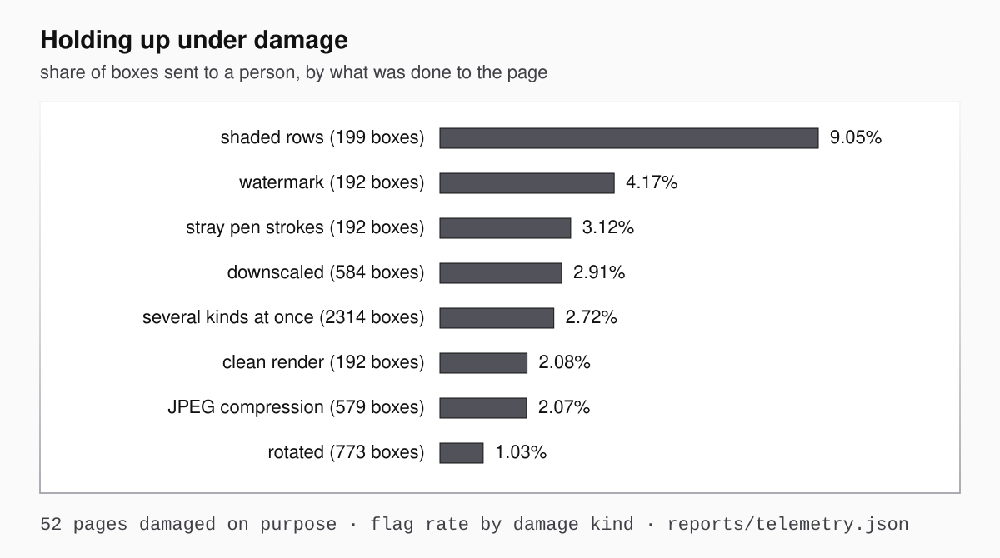
</p>

*The flag rate under each kind of deliberate damage, drawn from the same telemetry the dashboard reads; shading is where the queue fills first.*

Switching the trained model on changes no answer at all: the same 286 boxes found, the same 285 marks read correctly. What it changes is the review queue, from 2 boxes to 19, because it disagrees on 17 boxes the deterministic reader got right. On this evidence it is not yet earning the review time it asks for, so the honest figure to carry into a cost conversation is both numbers, not the flattering one. Narrowing its disagreement to boxes where the deterministic read is already near a boundary is the cheapest fix on the roadmap.

Two timings, because they measure different things. The reading itself takes a median of 284 ms, measured over all 61 pages. A full round trip through the HTTP service is p50 392 ms and p95 457 ms on a single worker, and the difference is the web layer, not the reading.

## Pages it had never seen

Four pages cannot tell you whether something generalizes, so after the system was finished I went looking for more. Three unrelated appraisal offices publish completed sample reports with fictional borrowers. None of them was used while building or tuning anything here. Fetch and score them yourself with `uv run python scripts/fetch_holdout.py --score`. The flag column below is the deterministic core; with the trained model switched on, one of these pages flags 37 of its 118 boxes, which is the same overreach described above and the reason it is on the roadmap.

| page | source | boxes found | marked | flagged | form recognized |
|---|---|---|---|---|---|
| FHA appraisal | Piekos Appraisals, IL | 118 | 45 | 0 | yes |
| VA appraisal | Piekos Appraisals, IL | 118 | 46 | 0 | yes |
| standard appraisal | RealVals | 118 | 38 | 0 | yes |
| FHA appraisal | Key Realty, MD | 118 | 37 | 0 | yes |
| **condominium appraisal** | Piekos Appraisals, IL | 88 | 33 | 0 | **no, and it said so** |

The four standard appraisals returned 118 boxes each, which is exactly the number on the blank federal form, from three different offices in three different years. The interesting row is the last one. That is a condominium report, a different federal form the system has no blank copy of and had never encountered. It read the page anyway, found all 88 boxes, and got every mark right on inspection.

What it did with the form question is worth being exact about, because it is not a clean win. It matched the condominium page to the standard form and scored that match a perfect 1.0, which is simply wrong. What caught it is the layer behind that: the two readers agreed on only 68 of the 118 positions the standard form expects, so the reading was marked untrusted and the second reader was dropped for that page. The form matcher was confidently wrong and the check behind it held. That is the behaviour I want on a page nobody taught it, and it is also a reminder that a confidence score is not a safety mechanism.

Two of those PDFs open on a photograph cover page rather than the form. The system returned zero boxes for both, which is the correct answer and not a given.

These pages carry no box-by-box labels, so this is a spot check by eye rather than a scored result, and it is described that way on purpose. What it establishes is narrow and worth having: the system holds up on documents from offices it has never seen, and it degrades honestly on a form nobody taught it.

## What it looks like in operation

<p align="center">
  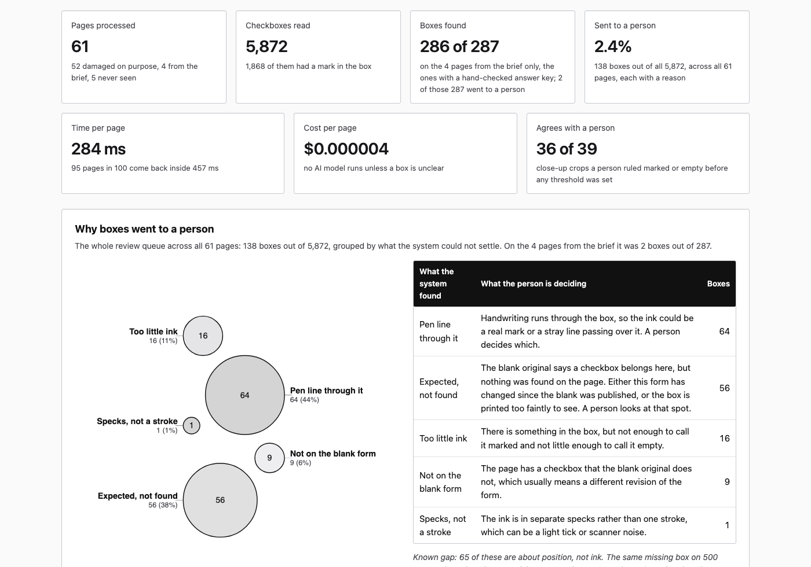
</p>

See it live at [jameswniu.github.io/synthetic-image-recognition-cnn-harness](https://jameswniu.github.io/synthetic-image-recognition-cnn-harness/), or open [`deliverables/dashboard.html`](deliverables/dashboard.html) from the cloned folder. Either way it is one file, no server, no network, no build step.

Everything on it was measured over 61 pages and 5,872 checkboxes: the 52 synthetic pages built by damaging blank federal forms on purpose, the 4 from the brief, and the 5 completed appraisals from three offices that were never used while building anything.

The panel that matters is the one showing why boxes went to a person. A flag rate on its own is a budget line. A breakdown saying 64 boxes had a pen line crossing them, 56 were places the form expected a box the page did not show, and 16 had too little ink to call is something an operator can act on without opening a single document. That is the difference between knowing a queue exists and knowing what is in it.

<p align="center">
  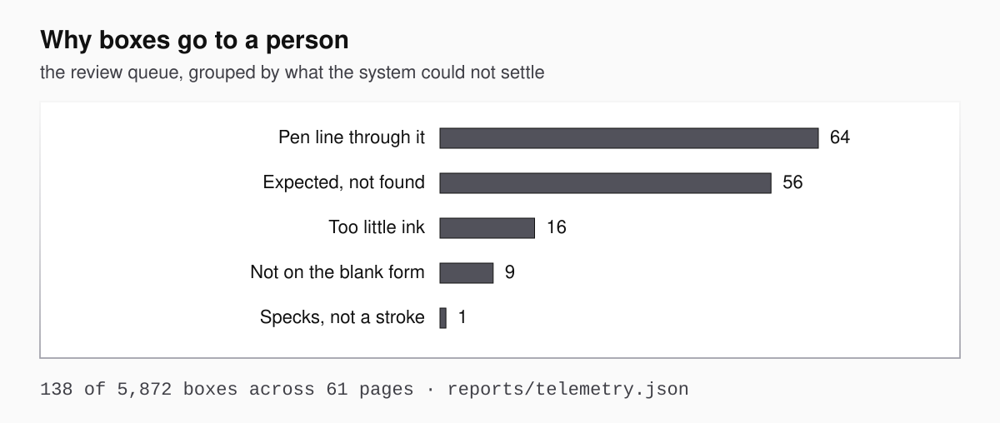
</p>

*The whole review queue by reason code, counts included, read from the same telemetry file the dashboard is built from.*

Three things on that page are worth reading before anyone asks:

- The held-out real appraisals flagged nothing at all. The queue comes almost entirely from pages that were damaged deliberately, which is what a robustness corpus is for.
- Shading is the hardest single condition, at 9.05% of boxes flagged against 1.03% for rotation. If real scans start looking like that, the queue is where it shows up first.
- The trained model disputes 6.6% of boxes on real pages and 3.5% on the synthetic pages it was trained against. It is noisiest exactly where the documents are real, and it changes no answer either way.

With real volume the same counts do something more useful. Joined to the form's official field names, they say which questions confuse the people filling the form in, which the customer can fix by changing the form rather than by reviewing more documents. That join needs the template registry to carry field names, which is item 2 on [the roadmap](docs/ROADMAP.md) and is not built here.

## How it is judged

Three separate referees, because a system that grades its own homework is not a system.

The **four real pages** ask whether it reads real documents correctly. The **blank official forms** ask whether it invents marks: nothing on a blank form is marked, so any mark it reports there is a mistake with no argument possible. And a **frozen set of 76 close-up crops**, labeled by a person in a small [labeling tool](labeling/labeling-booth.html) before any of the thresholds were tuned, asks whether the system agrees with human judgment on exactly the cases where judgment is required.

That third referee is the one that sets policy. It is where the rule came from that a scribbled-out box is not a checked box, that a stray pen line through a box is not a mark, and that a circle drawn in a box is a case nobody should answer confidently. Those rulings are written down in [POLICY.md](POLICY.md), and the system is measured against them rather than against my opinion.

## Q&A

<details>
<summary><b id="where-do-you-put-your-own-eyes-on-it">Where do you put your own eyes on it?</b></summary>

Four places, and each one is a command you can run rather than a claim you have to accept.

- Look at what it saw. `make overlays` draws every box on all four pages, green for checked, red for empty, amber for held back. This is the cheapest way to disagree with the system, and it is how I confirmed the box it had invented around a printed word was really there on the page.
- Ask it about one box. Adding `?explain=true` returns the ink fraction, the confidence, the reason codes behind any flag, which form it matched, how far the two readers agreed, and every candidate it threw away with why. I would check that last field first, because rejection is the only place this system removes something instead of flagging it.
- Re-run the scoreboard. `make eval` reprints the results table above from scratch, and `make test` runs the 26 gates. Two of those gates I checked by deliberately reverting the fix and confirming they fail, because a green test that would pass anyway is worse than no test.
- Try pages nobody tuned on. `uv run python scripts/fetch_holdout.py --score` fetches five completed appraisals from three unrelated offices and scores them live.

In production the place a person looks is the exception queue, and that is the whole point of the shape. Two boxes out of 287 here, each carrying a reason code, instead of a person re-reading 287.

- Not measured: how often a reviewer disagrees with a box the system was confident about. Sampling only the flagged ones can tell you the queue is working but never that it is catching enough, so that check has to sample the confident answers too.

</details>

<details>
<summary><b id="how-do-we-change-what-counts-as-a-marked-box">How do we change what counts as a marked box?</b></summary>

You edit a file. It is not a ticket, a release, or a conversation with whoever wrote the detector.

- [`policy.json`](policy.json) holds the thresholds and the three rulings people actually argue about: whether a single thin stroke counts, what a pen line crossing the box means, and what to do with a box that has been scribbled out. Each takes `filled`, `empty`, or `route`.
- `route` is the one worth knowing about. It flags the box and reports the raw ink lean rather than asserting an answer, which is how you say "a person should look at this" without pretending the system decided.
- `uv run python scripts/compare_policies.py` scores the shipped policy against a stricter one on the same pages. Two boxes read differently and agreement with the answer key goes 285 of 286 to 286 of 286, with no source file touched.
- The stricter policy is not simply better. It gets the faded X right by refusing to overrule ink on a fragmented mark, and the same rule would let a scribbled-out box report as filled. Which error you prefer is a business decision, which is exactly why it lives in a file rather than in our judgement.
- Not measured: how often real customers actually disagree with the shipped defaults. Two policies is a demonstration that the seam exists, not evidence about where people land.

</details>

<details>
<summary><b id="why-read-boxes-off-a-picture-when-the-data-file-already-has-them">Why read boxes off a picture when the data file already has them?</b></summary>

Because the data file does not always exist, and when it does, agreeing with it is not the same as being checked against it.

- Appraisals delivered on the standard federal forms come with a structured data file, and the agencies already score that data automatically and for free. Anything built on top of the data alone is competing with something that costs nothing.
- Plenty of documents have no such file: older scans, faxed copies, third-party review forms, and anything outside the standard set. For those the picture is the only record there is.
- When both exist, reading them independently turns one source into two, and a disagreement between the data file and the document a human would actually read is a finding, not noise.
- Not measured: how often those two actually disagree in production. That rate is the whole business case for this capability, and it needs real volume to establish.

</details>

<details>
<summary><b>Why not just use OCR?</b></summary>

Because OCR reads text, and a checkbox is not text. Handing a page to an OCR engine gets you the words next to the boxes, not the state of the boxes themselves.

- OCR finds and transcribes characters. An empty square and a marked square contain no characters, so the thing you need is exactly the thing OCR discards.
- Commercial document services do offer checkbox extraction as a separate feature (Textract calls them selection elements; Azure and Google have equivalents, priced around a cent per page), so this is a distinct capability, not a setting on OCR.
- Those services are a reasonable buy for low volume. They are worth building past when you want control of the failure modes, no per-page fee at scale, and the ability to say exactly why any single box was read the way it was.
- Not measured: a head-to-head accuracy comparison against Textract or Azure on these four pages. It is one afternoon of work and it is the first thing I would run before recommending build over buy.

</details>

<details>
<summary><b>Then why use an AI model at all?</b></summary>

For judgment on the handful of boxes where the rules honestly run out, and for nothing else.

- On these pages that is 0.7% of boxes: faded ink, a stray pen stroke, a mark that is neither clearly present nor clearly absent.
- Those cases are not a bug to engineer away. Two careful people disagree on them, which is precisely why a second opinion is worth paying for there and nowhere else.
- The model never gets to invent a box or delete one. It can only settle a question about a box the deterministic part already found and already flagged.
- Not measured: how often the model actually agrees with the human ruling on those cases, because that needs live calls the submission does not make. The machinery to run and replay that comparison is built and documented.

</details>

<details>
<summary><b>Which part is deterministic, which part is not, and what does each cost?</b></summary>

Everything that produces an answer is deterministic; the only non-deterministic component sits behind the exception queue and is off by default.

- Deterministic: finding boxes, reading marks, matching against the known form, and every published number in this README. Same page in, same answer out, forever. About four millionths of a dollar per page.
- Non-deterministic: two model readers on a flagged thumbnail, and a stronger referee only when they disagree. About a tenth of a cent per page at the deterministic core's flag rate, and nine tenths of a cent if the trained model's disagreements are queued too.
- Every model call is recorded and replayed from the record, so the same page gives the same answer offline and any decision can be audited months later.
- Not measured: cost at real production mix. The 0.7% flag rate comes from four pages, and worse scans will flag more, which is exactly the number to watch when the volume is real.

</details>

<details>
<summary><b>What happens on a page it has never seen?</b></summary>

It still reads the page, it knows it is unfamiliar, and it says so when you ask it to explain itself.

- The first reader needs no prior knowledge of the form, so an unrecognized layout is read normally; it just loses the second opinion.
- Ask for `?explain=true` and the response carries the form it matched, how far the two readers agreed, and whether that agreement was enough to trust. The default response stays exactly the shape the brief asked for. On the condominium page the form match was wrong and the agreement check is what caught it.
- The flag rate is the early warning. If a new batch of documents starts flagging far more boxes than usual, that is the alarm, and it fires before anyone has labeled a single page.
- Not measured: behavior on form types outside the three here. The way to close that is to shadow real volume, sample the disagreements, and put those crops in front of a person, which is the first step in [the roadmap](docs/ROADMAP.md).

</details>

<details>
<summary><b>Where does this sit next to the automated checks the agencies already run?</b></summary>

One layer above them, on the part of the document they do not read.

- Fannie Mae's Collateral Underwriter and Freddie Mac's Loan Collateral Advisor both score submitted appraisals automatically, at no cost, and a low enough score can earn relief on the value representation. Anything that competes with them on that ground loses.
- They score the structured data that came with the file. The pages themselves, the photographs, the addenda, and the appraiser's own commentary are outside what they evaluate.
- That leaves the document as the open ground: files that arrive with no data at all, everything the data fields do not carry, and the question of whether the data and the document actually agree. Checkbox reading is one small piece of that, and it is the piece that turns a page into something you can compare against.
- Not measured: how often data and document disagree in practice. That number is the case for the whole capability and it needs production volume, not four pages.

</details>

<details>
<summary><b>What would you do next, with real volume?</b></summary>

Run it alongside whatever exists today and spend human attention only where the two disagree.

- Agreement is cheap and uninformative; disagreement is where the information is. Sampling only the disagreements is how the labeled set grows without anyone reading pages at random.
- Every form revision gets its blank layout registered once, which also gives each box its official field name, so downstream systems get named answers instead of coordinates.
- Once enough real pages are labeled, a trained detector becomes worth it, with this system as its auto-labeler and its permanent cross-check.
- Not measured: any of it. This is the plan, not a result, and it is written as a plan in [ROADMAP.md](docs/ROADMAP.md).

</details>

## Map

```
policy.json                     what counts as a marked box; the customer owns this file
policy-strict.json              a second customer, same code, different answers
src/hv_checkbox/
  normalize.py                  clean up the page, measure the expected box size
  detect.py                     reader 1: find boxes from the printed lines
  template.py                   reader 2: recognize the form, match its known boxes
  classify.py                   decide marked or not, and how sure
  policy.py                     reads policy.json; the thresholds used to live in classify.py
  patch_model.py                optional small trained second opinion
  escalate.py                   the exception queue and the AI check behind it
scripts/
  serve.py                      the HTTP service
  evaluate.py                   the referees: reprints every number in this README
  compare_policies.py           same pages, two definitions of a mark, what moved and why
  compare_readers.py            the rules, the trained model, and both together, raced on the same answer key
  telemetry.py                  every page through the pipeline, with per-reason-code counts
  synth.py                      generates test pages by damaging blank forms on purpose
  mine_edges.py                 turns measured failures into the next batch of human questions
tools/
  make_dashboard.py             builds deliverables/dashboard.html from reports/telemetry.json, no dependencies
  make_deck.py                  builds deliverables/checkbox-approach.pptx, the deck for the review meeting
  make_walkthrough.py           builds the code-walkthrough Word document, in the same theme
  make_visuals.py               the page figures above, drawn from real output
  draw_figures.py               the banner, the four dimensions and A/B/C, in the house palette, from the reports
reports/                        the measured numbers as JSON; everything above reads from here
deliverables/
  dashboard.html                the operator view; open it, no server needed
  checkbox-approach.pptx        the deck
  checkbox-code-walkthrough.docx  the code walkthrough
labeling/
  labeling-booth.html           where a person defines what counts as marked
data/                           the pages, the labels, the blank forms, the frozen answer key
docs/                           the writeup, the eval spec, the roadmap, the run log
tests/                          the 26 gates make test runs
```

Deeper documents, in the order they are worth reading: [the writeup](docs/approach.md), [the labeling policy](POLICY.md), [what is measured and how](docs/EVALS.md), [the log of every run including the failures](docs/iterations.md), [the dataset card](data/README.md), [the production roadmap](docs/ROADMAP.md), [how the AI check is kept honest](docs/judge-replay.md).

If you do one thing with this repo, run `make overlays` and look at the four pages it draws. Every claim above is downstream of what you will see there, and [the four places I check it myself](#where-do-you-put-your-own-eyes-on-it) are all one command each.

## License

Source code: Apache-2.0. The sample pages and official form renders under `data/` are evaluation inputs only and are not covered by the license; see [NOTICE](NOTICE).
